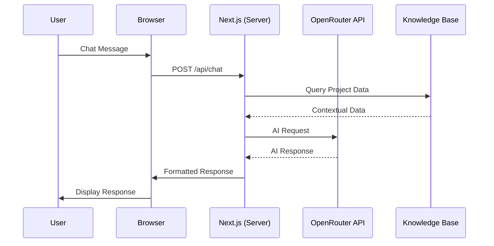
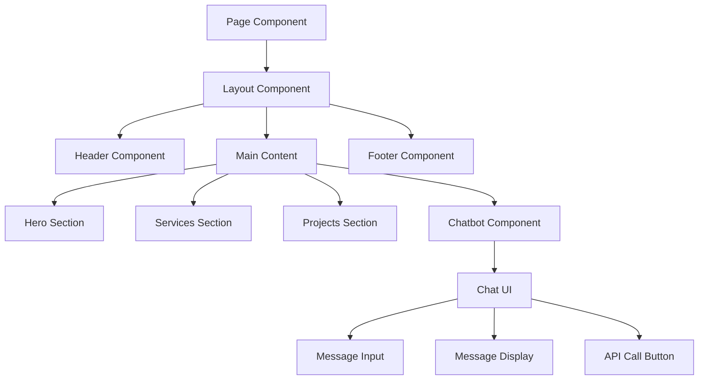
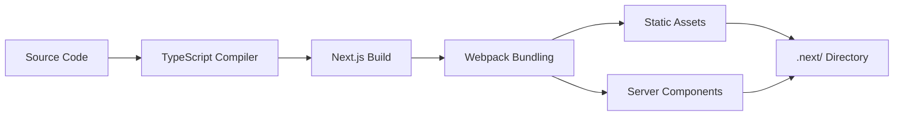

# TechSolve Architecture Overview

## System Architecture

TechSolve is a modern, full-stack web application built with Next.js 15, featuring a server-side rendered React frontend and API routes for backend functionality. The architecture follows contemporary web development patterns with a focus on performance, maintainability, and user experience.

## 🏗️ Architecture Components

### Frontend Architecture

#### Next.js App Router
- **File-based Routing**: Pages and API routes are organized in the `app/` directory
- **App Router**: Modern routing with layout nesting and loading states
- **Server Components**: Default rendering strategy for optimal performance
- **Client Components**: Interactive features (forms, chat, animations)

#### Component Architecture

```
components/
├── ui/                  # Atomic design: shadcn/ui components
├───── button.tsx       # Primitive components (Button, Input, etc.)
├───── card.tsx
├───── dialog.tsx
│
├── animations/          # Animation utilities
├───── animated-section.tsx
├───── stagger-container.tsx
├───── parallax-section.tsx
│
├── *-section.tsx        # Page sections (Hero, Services, Projects)
├───── hero-section.tsx
├───── services-section.tsx
├───── projects-section.tsx
│
├── chatbot.tsx          # Feature-specific components
├── header.tsx
├── footer.tsx
└── theme-toggle.tsx
```

#### State Management
- **React Hooks**: Local component state with useState/useEffect
- **Context API**: Theme management with next-themes
- **Custom Hooks**: Reusable logic in `hooks/` directory

### Backend Architecture

#### API Routes (`app/api/`)
```
app/api/
└── chat/
    └── route.ts         # Chatbot API endpoint
```

- **RESTful Design**: Standard HTTP methods (GET, POST)
- **TypeScript**: Full type safety for request/response handling
- **Middleware**: Built-in Next.js API middleware

### Data Layer

#### Knowledge Base (`lib/knowledge-base.ts`)
- **Static Data**: Company information, projects, team details
- **Typed Structures**: Strong typing with TypeScript interfaces
- **Search Functions**: Project and service lookup capabilities

#### Data Flow
```
User Input → API Route → Knowledge Base → OpenRouter API → Response → Frontend
```

## 🛠️ Technology Stack Details

### Core Technologies

| Technology | Purpose | Version |
|------------|---------|---------|
| Next.js 15 | React Framework | Latest |
| React 19 | UI Library | Latest |
| TypeScript | Type Safety | 5.x |
| Tailwind CSS | Styling | 3.4.x |

### UI & Animation

| Library | Purpose | Features |
|---------|---------|----------|
| Radix UI | Accessible Components | Primitives for complex UI |
| Framer Motion | Animations | Declarative animations |
| Lucide React | Icons | SVG icon system |
| shadcn/ui | Component System | Pre-built accessible components |

### Development Tools

| Tool | Purpose |
|------|---------|
| ESLint | Code Quality |
| PostCSS | CSS Processing |
| Tailwind CSS | Utility-first CSS |
| TypeScript Compiler | Type Checking |

## 🔄 Data Flow Architecture

### Client-Server Interaction



### Component Data Flow



## 🗂️ Project Structure Analysis

### Directory Structure Rationale

```
app/                    # Next.js App Router
├── api/               # API endpoints
├── (page).tsx         # Page components
└── **/page.tsx        # Nested routes

components/            # Component composition
├── ui/               # Design system atoms
├── animations/       # Animation molecules
└── *-section.tsx     # Page organisms

lib/                  # Business logic
├── knowledge-base.ts # Domain models
├── utils.ts         # Helper functions
└── cookies.ts       # Cross-cutting concerns
```

## 🎨 Styling Architecture

### Design System

#### CSS Variables (CSS Custom Properties)
```css
:root {
  --background: hsl(0, 0%, 100%);
  --foreground: hsl(222, 47%, 11%);
  --primary: hsl(210, 100%, 50%);
  --secondary: hsl(210, 100%, 50%);
  /* ... more variables */
}
```

#### Utility-First CSS with Tailwind
- **Breakpoints**: `sm:`, `md:`, `lg:`, `xl:`, `2xl:`
- **Spacing**: Consistent spacing scale (0.5rem increments)
- **Colors**: Semantic color system with CSS variables

#### Theme Architecture
- **next-themes**: Client-side theme switching
- **Dark Mode**: Automatic dark mode detection
- **System Preference**: Respects user's OS theme setting

## 🚀 Performance Considerations

### Next.js Optimizations
- **App Router**: Server components by default
- **Automatic Code Splitting**: Route-based splitting
- **Image Optimization**: Built-in Next.js Image component
- **Font Optimization**: Automatic font loading

### Component Performance
- **React.memo**: Prevents unnecessary re-renders
- **Lazy Loading**: Dynamic imports for heavy components
- **Animation Libraries**: Hardware-accelerated animations

### Bundle Analysis
- **Tree Shaking**: Automatic dead code elimination
- **Code Splitting**: Optimized bundle sizes
- **Asset Optimization**: Compressed images and fonts

## 🔒 Security Architecture

### Server-Side Security
- **API Key Management**: Environment variables for sensitive data
- **Input Validation**: Zod schemas for request validation
- **Error Handling**: Graceful error responses without data leakage

### Client-Side Security
- **XSS Prevention**: React's automatic escaping
- **CSRF Protection**: Built-in Next.js protections
- **Content Security Policy**: Configurable CSP headers

## 🔧 Development Workflow

### Build Process


### Deployment Architecture
- **Vercel**: Recommended hosting platform
- **Edge Functions**: Global CDN distribution
- **Incremental Static Regeneration**: Dynamic content updates
- **Analytics**: Built-in performance monitoring

## 📊 Monitoring & Analytics

### Built-in Monitoring
- **Vercel Analytics**: Real-time performance metrics
- **Error Tracking**: Automatic error reporting
- **Core Web Vitals**: Google Web Vitals monitoring

### Development Monitoring
- **React DevTools**: Component inspection
- **Browser DevTools**: Network and performance analysis
- **TypeScript**: Compile-time error detection

## 🔮 Future Architecture Considerations

### Scalability
- **Microservices**: Potential API separation
- **Edge Computing**: Global performance optimization
- **CDN Integration**: Static asset distribution

### Feature Extensions
- **CMS Integration**: Content management system
- **Payment Processing**: E-commerce capabilities
- **Multi-tenancy**: B2B platform features
- **Progressive Web App**: Mobile app capabilities

This architecture provides a solid foundation for current requirements while maintaining flexibility for future enhancements and scalability needs.
